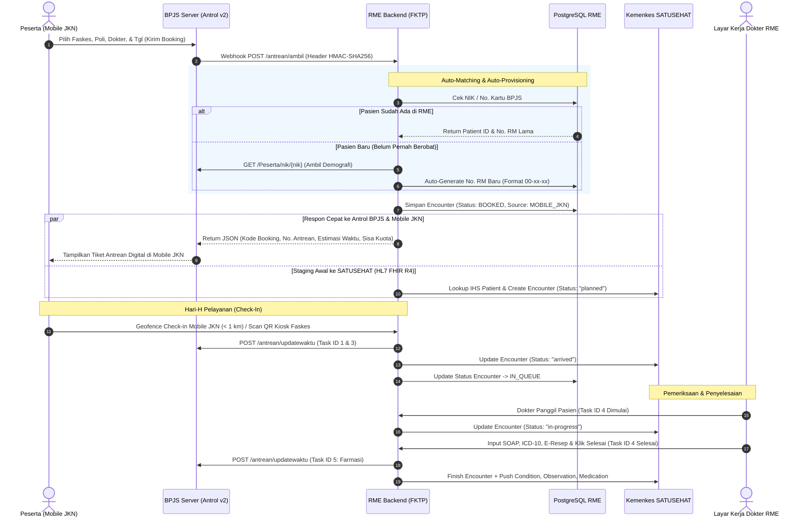

# 📲 Panduan Integrasi Mobile JKN (MJKN) & Antrean Online BPJS v2 (Antrol) FKTP

Dokumen ini menjelaskan spesifikasi teknis, mekanisme *Webhook Endpoint*, logika pencocokan pasien otomatis (*Patient Auto-Matching & Auto-Provisioning*), serta sinkronisasi multi-sistem **4-Way Sync** antara:
1. **Mobile JKN (MJKN)**
2. **Rekam Medis Elektronik (RME)**
3. **Antrol BPJS Kesehatan v2**
4. **Kemenkes SATUSEHAT (HL7 FHIR R4)**

---

## 🏛️ 1. Blueprint Arsitektur 4-Way Sync

Saat peserta BPJS mendaftar pelayanan rawat jalan di FKTP (Puskesmas atau Klinik Pratama) melalui aplikasi Mobile JKN, alur data mengalir secara otomatis tanpa memerlukan input manual dari petugas loket pendaftaran:



---

## 🔌 2. Spesifikasi Webhook BPJS Antrol v2 yang Wajib Dibuka FKTP

Sesuai standar integrasi BPJS Antrean Online v2, sistem RME FKTP wajib menyediakan endpoint *inbound webhook* dengan port HTTPS terbuka dan divalidasi dengan signature BPJS:

### 2.1 Webhook: Ambil Antrean (`/antrean/ambil`)
Dipanggil oleh BPJS saat peserta menekan tombol booking antrean di aplikasi Mobile JKN.

* **Method:** `POST`
* **Path:** `/api/v1/antrol/ambil`
* **Headers Wajib:**
  * `x-cons-id`: ID Faskes
  * `x-timestamp`: Timestamp UTC
  * `x-signature`: HMAC-SHA256
  * `user_key`: Kunci otorisasi antrol
* **Request Body dari BPJS:**
  ```json
  {
    "nomorkartu": "0001234567890",
    "nik": "3171012304790002",
    "notelp": "081234567890",
    "kodepoli": "001",
    "namapoli": "Poli Umum",
    "kodedokter": "DOC-01",
    "namadokter": "dr. Siti Rahmawati, Sp.PD",
    "tanggalperiksa": "2026-09-22",
    "jampraktek": "08:00-12:00",
    "jeniskunjungan": 1,
    "nomorreferensi": ""
  }
  ```
* **Response Body `200 OK` (Dikembalikan ke BPJS & Mobile JKN):**
  ```json
  {
    "response": {
      "nomorantrean": "A-07",
      "angkaantrean": 7,
      "kodebooking": "MJKN-20260922-007",
      "norm": "00-12-89",
      "namapoli": "Poli Umum",
      "namadokter": "dr. Siti Rahmawati, Sp.PD",
      "estimasidilayani": 1726972800000,
      "sisakuotajkn": 13,
      "kuotajkn": 20,
      "sisakuotanonjkn": 10,
      "kuotanonjkn": 15,
      "keterangan": "Peserta harap hadir 15 menit sebelum estimasi waktu layanan."
    },
    "metadata": {
      "code": 200,
      "message": "Ok"
    }
  }
  ```

---

### 2.2 Webhook: Status & Sisa Antrean (`/antrean/sisa`)
Menghitung posisi antrean yang sedang berlangsung saat pasien memantau dari Mobile JKN.

* **Method:** `POST`
* **Path:** `/api/v1/antrol/sisa`
* **Request Body:**
  ```json
  {
    "kodebooking": "MJKN-20260922-007"
  }
  ```
* **Response Body `200 OK`:**
  ```json
  {
    "response": {
      "nomorantrean": "A-07",
      "namapoli": "Poli Umum",
      "namadokter": "dr. Siti Rahmawati, Sp.PD",
      "sisaantrean": 3,
      "antreanpanggil": "A-04",
      "waktutunggu": 900,
      "keterangan": ""
    },
    "metadata": {
      "code": 200,
      "message": "Ok"
    }
  }
  ```

---

### 2.3 Webhook: Pembatalan Antrean (`/antrean/batal`)
Jika peserta membatalkan rencana kedatangan melalui aplikasi Mobile JKN.

* **Method:** `POST`
* **Path:** `/api/v1/antrol/batal`
* **Request Body:**
  ```json
  {
    "kodebooking": "MJKN-20260922-007",
    "keterangan": "Pasien berhalangan hadir"
  }
  ```
* **Logika RME:**
  * Status `Encounter` di database diubah menjadi `CANCELLED`.
  * Kuota dokter di-restore (+1 kuota sisa).
  * Update status FHIR Encounter di SATUSEHAT menjadi `cancelled`.

---

### 2.4 Webhook / API: Check-In Kehadiran Hari-H (`/antrean/checkin`)
Dilakukan saat pasien tiba di FKTP pada hari H (via tombol Check-In Mobile JKN radius < 1 km faskes atau scan barcode di Kiosk antrean).

* **Method:** `POST`
* **Path:** `/api/v1/antrol/checkin`
* **Request Body:**
  ```json
  {
    "kodebooking": "MJKN-20260922-007",
    "waktu": 1726972200000
  }
  ```
* **Efek RME & Bridging:**
  1. Status Encounter di RME berubah menjadi `ARRIVED` / `IN_QUEUE`.
  2. Laporkan otomatis **Task ID 1** (Mulai tunggu) dan **Task ID 3** (Tunggu poli) ke BPJS Antrol.
  3. Update status Resource FHIR SATUSEHAT dari `planned` menjadi `arrived`.

---

## 🧮 3. Matriks Transisi Status 4-Way Multi-Sistem

Tabel berikut menjadi acuan utama sinkronisasi antar-sistem:

| Fase Alur Layanan | Mobile JKN | RME FKTP | Antrol BPJS | SATUSEHAT FHIR R4 |
| :--- | :--- | :--- | :--- | :--- |
| **1. Pasien Booking di HP** | Tiket Terbit (`A-07`) | `Encounter: BOOKED` | Kuota Berkurang | `Encounter: planned` |
| **2. Pasien Tiba & Check-In** | Status: "Telah Hadir" | `Encounter: IN_QUEUE` | **Task 1 & 3** Dikirim | `Encounter: arrived` |
| **3. Dokter Panggil Pasien** | Status: "Sedang Dilayani" | `Encounter: IN_CONSULTATION` | **Task 4** Dimulai | `Encounter: in-progress` |
| **4. Dokter Simpan SOAP & E-Resep**| Status: "Menunggu Obat" | `Encounter: PHARMACY_QUEUE` | **Task 4** Selesai / **Task 5** | Staging `Condition` & `Medication` |
| **5. Obat Diserahkan Apotek** | Status: "Pelayanan Selesai" | `Encounter: COMPLETED` | **Task 6 & 7** Selesai | `Encounter: finished` (Bundle Closed)|

---

## 🛡️ 4. Aturan Bisnis Pasien Baru (Auto-Provisioning No. RM)

1. **Pengecekan NIK:**
   * Setiap request pendaftaran dari MJKN membawa 16 digit `nik`.
   * Lakukan query: `SELECT id, no_rm, full_name FROM patients WHERE nik = :nik`.
2. **Jika Pasien Lama (Tercatat):**
   * Gunakan `id` dan `no_rm` yang sudah ada. Hubungkan encounter baru ke rekam medis pasien tersebut.
3. **Jika Pasien Baru:**
   * Ambil data nama, tanggal lahir, dan faskes asal dari payload MJKN atau panggil API BPJS `GET /Peserta/nik/{nik}`.
   * Generate nomor rekam medis berurutan berikutnya (format: `00-XX-YY`).
   * Lookup NIK ke SATUSEHAT Kemenkes untuk mendapatkan `IHS Patient ID`.
   * Insert data pasien baru ke tabel `patients` dengan flag `is_registered_via_mjkn = true`.
   * Kembalikan No. RM baru tersebut pada response payload BPJS Antrol agar tampil di Mobile JKN.

---

## 📍 5. Mekanisme Check-In Kehadiran Hari-H (Hybrid Architecture)

Untuk menjamin kelancaran antrean dan mengantisipasi berbagai kondisi peserta, sistem FKTP menerapkan pendekatan **Hybrid Check-In** dengan 2 metode yang saling melengkapi:

### A. Metode 1: Validasi Otomatis Berbasis Geolokasi Mobile JKN (GPS Geofence)
* **Karakteristik:** *Touchless & Low-Queue*. Peserta tidak perlu berdiri mengantre di mesin kiosk.
* **Aturan Bisnis:**
  * Tombol **"Check-In"** di aplikasi Mobile JKN peserta hanya dapat diaktifkan jika jarak peserta ke faskes memenuhi syarat:
    $$\text{Jarak (Distance)} \le 1.000\text{ meter (1 km)}$$
  * Faskes backend menghitung jarak menggunakan formula *Haversine* berdasarkan koordinat faskes dan koordinat GPS perangkat peserta:
    $$d = 2r \arcsin\left(\sqrt{\sin^2\left(\frac{\Delta \phi}{2}\right) + \cos(\phi_1)\cos(\phi_2)\sin^2\left(\frac{\Delta \lambda}{2}\right)}\right)$$
  * Jika jarak $> 1.000$ m, sistem menolak check-in dan mengembalikan kode status BPJS `400` dengan pesan: `"Anda belum berada di radius faskes (Jarak: ... m). Harap check-in setibanya di klinik."`

### B. Metode 2: Scan QR / Barcode Mandiri di Mesin Kiosk Faskes (On-Site Kiosk)
* **Karakteristik:** *Failsafe & Backup*. Sangat berguna jika:
  * Paket data/internet peserta habis.
  * GPS HP peserta kurang akurat / bermasalah.
  * Baterai HP peserta lemah.
* **Aturan Bisnis:**
  * Peserta memperlihatkan barcode/QR Code tiket dari Mobile JKN ke optical scanner mesin kiosk lobby klinik.
  * Mesin kiosk membaca barcode `kodebooking` (misal: `MJKN-20260921-001`).
  * Mesin kiosk mengirimkan request internal ke endpoint faskes dengan `kioskId: "KIOSK-LOBBY-01"`.

### C. Efek Check-In (Sama untuk Kedua Metode)
1. RME memperbarui status `Encounter` menjadi `IN_QUEUE` dengan `checkInStatus: "CHECKED_IN"` dan mencatat metode kedatangan (`checkInMethod`).
2. RME mengirim **Task ID 1** (Check-in dimulai) dan **Task ID 3** (Tunggu pelayanan dokter) ke API BPJS Antrol v2.
3. RME memperbarui Resource FHIR R4 `Encounter` di Kemenkes SATUSEHAT dari status `planned` menjadi `arrived`.

---

## ⚖️ 6. Distribusi Kuota Layanan (Rasio 60% Mobile JKN : 40% On-Site Walk-In)

Untuk menjaga keadilan akses antara peserta yang melek digital (online) dan pasien lansia/darurat yang datang langsung (walk-in), faskes menerapkan rasio alokasi kuota standar:

| Jalur Antrean | Rasio Alokasi | Contoh Kuota (Total 30 Pasien/Hari) | Karakteristik Layanan |
| :--- | :---: | :---: | :--- |
| **Mobile JKN (MJKN Online)** | **60%** | **18 Pasien** | Booking H-7 s/d H-1 sebelum hari periksa. Nomor antrean otomatis terbit di HP. |
| **On-Site (Loket / Walk-in)** | **40%** | **12 Pasien** | Pendaftaran langsung di loket admisi klinik pada hari-H untuk pasien umum, lansia, atau rujukan dadakan. |

### Kebijakan Auto-Release Sisa Kuota (Quota Overflow Policy):
1. Jika hingga **$H-2$ jam** sebelum jam sesi dokter berakhir masih terdapat sisa kuota pendaftaran Mobile JKN yang belum di-booking, sistem otomatis mengalihkan (*auto-release*) sisa kuota tersebut ke kuota *On-Site*.
2. Hal ini mencegah kapasitas dokter terbuang percuma (*idle doctor hours*) dan memberikan kesempatan bagi pasien antrean fisik di klinik untuk tetap terlayani.

