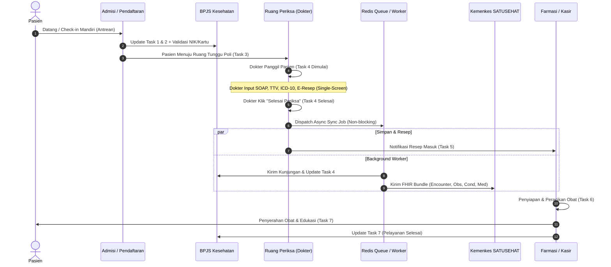

# 🩺 Developer Hub (Dev Hub) - Sistem Rekam Medis Elektronik (RME)

Selamat datang di **Developer Hub RME**. Dokumentasi ini dirancang sebagai panduan komprehensif bagi software engineer, UI/UX designer, DevOps, dan AI agent dalam mengembangkan, memelihara, serta mengintegrasikan sistem RME sesuai regulasi medis Indonesia.

---

## 🗺️ Peta Navigasi Dokumentasi

```
docs/
├── DEV_HUB.md                     <-- (Anda di sini) Indeks Utama & Roadmap
├── GOVERNANCE.md                  <-- Aturan kerja, evidence, ADR, dan quality gate agen
├── API_CONTRACT.md                <-- Kontrak RESTful API Resmi FE & BE (OpenAPI Ready)
├── ARCHITECTURE_AND_STACK.md      <-- Blueprint Arsitektur, Async Queue, & Struktur Folder
├── UI_UX_DESIGN_SYSTEM.md         <-- Design Tokens, Clinical Layout, & Keyboard Hotkeys
├── DATABASE_SCHEMA.md             <-- PostgreSQL DDL, JSONB FHIR, Audit Trail, & pg_trgm
├── BPJS_BRIDGING.md               <-- HMAC-SHA256, AES-256-CBC, LZ-String, & Antrean V2
├── BPJS_ANTROL_MJKN_INTEGRATION.md <-- Webhook MJKN, Auto-Matching Pasien, & 4-Way Multi-Sistem Sync
├── SATUSEHAT_FHIR.md              <-- OAuth2 Kemenkes, IHS Lookup, & FHIR R4 Bundles
└── STARKES_COMPLIANCE.md          <-- 1x24h Locking, Addendum, Audit Log, & Skrining Pasien
```

---

## 🎯 Standar Regulasi & Sertifikasi

| Regulasi / Standar | Instansi / Acuan | Komponen yang Terdampak |
| :--- | :--- | :--- |
| **Permenkes No. 24 Th 2022** | Kementerian Kesehatan RI | Kewajiban RME seluruh faskes, rekam medis terstandar, TTE, dan pelepasan data. |
| **HL7 FHIR Release 4** | Kemenkes SATUSEHAT | Interoperabilitas data klinis nasional (`Encounter`, `Condition`, `Observation`, dll). |
| **P-Care / V-Claim v2.0** | BPJS Kesehatan | Verifikasi kepesertaan, pembuatan SEP/kunjungan, dan rujukan antar faskes. |
| **Antrean Online BPJS v2** | BPJS Kesehatan | Task ID 1 sampai 7 (sinkronisasi waktu layanan dari pendaftaran hingga obat). |
| **STARKES / LPA FKTP** | Kemenkes / Lembaga Akreditasi | Keselamatan pasien (skrining jatuh/nyeri/alergi), audit trail, dan *medical record locking*. |
| **UU No. 27 Th 2022 (UU PDP)** | Pemerintah RI / Kominfo | Perlindungan data pribadi medis, enkripsi at rest/in transit, server lokal di NKRI. |

---

## 📋 Glosarium Istilah Medis & Teknis

* **CPPT:** *Catatan Perkembangan Pasien Terintegrasi* — lembar rekam medis format SOAP yang diisi oleh dokter, perawat, apoteker, dan nakes lain secara kolaboratif.
* **SOAP:** Format standar pengkajian klinis:
  * **S (Subjective):** Keluhan utama, riwayat penyakit sekarang (RPS), riwayat alergi.
  * **O (Objective):** Pemeriksaan fisik, tanda vital (TTV), status lokalis, hasil lab/penunjang.
  * **A (Assessment):** Diagnosa kerja / banding (kode ICD-10).
  * **P (Plan):** Rencana terapi, e-resep, tindakan medis (ICD-9-CM), edukasi pasien, atau rujukan.
* **IHS (Indonesia Health Services):** Nomor pengenal tunggal yang diterbitkan SATUSEHAT untuk Pasien (*IHS Patient*), Dokter/Nakes (*IHS Practitioner*), dan Organisasi Faskes (*Organization ID*).
* **KFA (Kamus Farmasi & Alat Kesehatan):** Standar master data obat dan alkes nasional yang dikelola oleh Kemenkes RI.
* **SEP (Surat Eligibilitas Peserta):** Surat izin penjaminan klaim perawatan yang diterbitkan oleh sistem BPJS Kesehatan.
* **Addendum:** Catatan pembetulan resmi pada rekam medis yang telah terkunci, tanpa mengubah/menghapus rekam data sebelumnya.
* **Cons-ID & User-Key:** Kredensial autentikasi API Bridging yang diberikan oleh BPJS Kesehatan untuk setiap faskes.

---

## 🚀 Alur Kerja Pasien (Patient Journey Lifecycle)



---

## 🛠️ Checklist Developer Sebelum Go-Live

- [ ] **Kriptografi BPJS:** Unit test formula signature HMAC-SHA256 dan dekripsi AES-256-CBC lulus 100%.
- [ ] **SATUSEHAT Token Cache:** Token OAuth2 di-cache di Redis/memory dengan TTL 3500 detik (tidak request token baru di setiap transaksi).
- [ ] **Asynchronous Processing:** Tidak ada panggilan API luar (BPJS/SATUSEHAT) yang memblokir render UI dokter (latensi klik simpan `< 300ms`).
- [ ] **Audit Trail:** Trigger database atau middleware berhasil mencatat user, IP, action, timestamp, dan perubahan data.
- [ ] **Medical Record Locking:** Cron job / status check mengunci berkas SOAP yang telah berumur `> 24 jam`.
- [ ] **Fuzzy Search Index:** Ekstensi `pg_trgm` aktif pada tabel ICD-10 dan KFA dengan indeks GIN.
