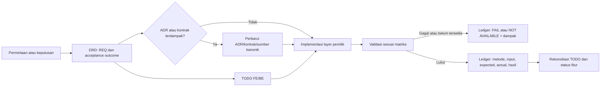

# Peta Pengetahuan SDLC RME

**Status:** Indeks navigasi aktif, bukan sumber kebijakan baru
**Owner:** Repository maintainers
**Terakhir direkonsiliasi:** 2026-09-24
**Scope:** Membantu Product, Engineering, QA, release owner, dan AI menemukan sumber kebenaran RME sebelum melakukan perubahan.

Dokumen ini adalah padanan peta pengetahuan SDLC Qlickhub yang disesuaikan untuk RME. Ia hanya merangkum dan menautkan aturan yang sudah berlaku. Jika isinya berbeda dari sumber yang ditautkan, sumber tersebut yang berlaku.

## 1. RME dalam satu pandangan

RME adalah produk rekam medis elektronik untuk layanan kesehatan Indonesia. Perubahan harus melindungi keselamatan pasien, privasi, ketepatan klinis, auditability, dan kontinuitas layanan. Artefak delivery saat ini berpusat pada satu folder per fitur:

```text
Permintaan / keputusan pengguna
  → DRD: sumber, scope, REQ, keputusan, risiko, blocker
  → TODO FE dan/atau BE: pekerjaan yang menunjuk REQ dan Evidence ID
  → ADR atau kontrak/domain bila batas yang diubah memerlukannya
  → implementasi pada layer pemilik
  → Evidence ledger: hasil validasi aktual
  → status fitur dan keputusan rilis oleh release owner
```

`VALIDATED` membuktikan requirement yang dicatat di DRD telah tervalidasi. `RELEASE_READY` dan `RELEASED` tetap memerlukan ketentuan di [Governance](GOVERNANCE.md); dokumen ini tidak menyatakan bahwa environment deployment atau proses release sudah tersedia.

## 2. Sumber kebenaran dan urutan otoritas

| Informasi yang dicari | Sumber kanonik | Gunakan ketika |
| --- | --- | --- |
| Instruksi lokal dan perlindungan workspace | [AGENTS.md](../AGENTS.md) | Setiap perubahan |
| Urutan otoritas, keselamatan, ADR, definisi selesai | [Governance](GOVERNANCE.md) | Setiap perubahan substantif |
| Lifecycle fitur, DRD, TODO, status, Evidence ledger | [Sistem Kerja Fitur](FEATURE_WORKFLOW.md) | Setiap perubahan fitur |
| Aturan penulisan kode dan pembaruan dokumen | [Standar Kode](CODE_STANDARDS.md) | Kode, kontrak, atau dokumentasi |
| Status, requirement, keputusan, dan bukti fitur tertentu | [Registry fitur](features/README.md) dan `docs/features/<feature-id>/DRD.md` | Perubahan dalam satu fitur |
| Alur pasien, istilah klinis, dan peta domain | [Developer Hub](DEV_HUB.md) | Perubahan domain/klinis |
| Kontrak request/response dan error API | [Kontrak API](API_CONTRACT.md) | UI data, endpoint, atau integrasi |
| Skema, audit, isolasi, dan migrasi data | [Skema Database](DATABASE_SCHEMA.md) | Persistensi atau migrasi |
| Routing, ownership komponen, dan Atomic Design | [Arsitektur Frontend](FRONTEND_ARCHITECTURE.md) serta [UI/UX Design System](UI_UX_DESIGN_SYSTEM.md) | Perubahan frontend |
| BPJS, Antrol, dan SATUSEHAT | [Dokumen BPJS](BPJS_BRIDGING.md), [Antrol/MJKN](BPJS_ANTROL_MJKN_INTEGRATION.md), dan [SATUSEHAT FHIR](SATUSEHAT_FHIR.md) | Bridging atau interoperabilitas |
| Rekam medis, locking, addendum, dan safety safeguards | [STARKES Compliance](STARKES_COMPLIANCE.md) | Perubahan klinis, audit, atau rekam medis |
| Tanggung jawab delivery, handoff, dan release decision | [Delivery Workflow and Roles](SDLC_WORKFLOW_AND_ROLES.md) | Review lintas peran atau keputusan release |
| Test case, defect/retest, dan evidence release | [QA Traceability](QA_TRACEABILITY.md) | QA planning, validation, failure, atau retest |
| Environment, release preflight, dan recovery | [Deployment and Environments](DEPLOYMENT_AND_ENVIRONMENTS.md) | Deployment, migration, rollback, atau environment evidence |
| Incident dan hotfix | [Incident and Hotfix](INCIDENT_AND_HOTFIX.md) | Suspected safety, privacy/security, data, integration, atau release incident |
| ID policy stabil | [Policy Registry](POLICY_REGISTRY.md) | Menautkan plan, DRD, handoff, atau ADR ke aturan kanonik |
| Keputusan tahan lama yang telah disetujui | [ADR](adr/README.md) | Bila perubahan menyentuh batas keputusan |

Urutan konflik: instruksi eksplisit pengguna → aturan hukum, keamanan, dan keselamatan pasien → ADR/kontrak yang berlaku → [Governance](GOVERNANCE.md) dan `AGENTS.md` → dokumen domain/arsitektur → implementasi yang tidak bertentangan → asumsi reversible yang diberi label. Rincian otoritas berada di Governance §1.

## 3. Jalur baca menurut tanggung jawab delivery

Tanggung jawab di bawah menjelaskan urutan baca, bukan penambahan role aplikasi atau hak akses runtime.

| Tanggung jawab | Baca lebih dahulu | Lalu pastikan |
| --- | --- | --- |
| Product / pemilik scope | Developer Hub, Governance, DRD fitur, ADR terkait | Scope, acceptance outcome, dan keputusan yang belum disetujui tidak dianggap fakta |
| Frontend | DRD, TODO FE, kontrak API, arsitektur frontend, design system | State loading/empty/error/disabled, aksesibilitas, dan bukti browser sesuai requirement |
| Backend / data | DRD, TODO BE, kontrak API, skema database, ADR | Validasi, authorization, audit, idempotensi, migrasi/recovery, dan bukti contract/database sesuai scope |
| QA / reviewer | DRD requirement dan Evidence ledger, kontrak/domain terkait | Input sintetis/redaksi, expected vs actual, serta batas bukti yang tidak tersedia tercatat jujur |
| Release owner | DRD, evidence ledger, risks/blockers, kontrak dan ADR yang terdampak | Status `VALIDATED` tidak disalahartikan sebagai deployment atau persetujuan rilis |
| AI / programmer | `AGENTS.md`, Governance, Feature Workflow, DRD, TODO, lalu sumber teknis relevan | Tidak mengubah kebijakan, data, kontrak, atau safety behavior berdasarkan tebakan |

## 4. Jejak kebutuhan sampai bukti



Kaitan yang harus dapat ditelusuri saat relevan adalah `REQ-### → task FE/BE → keputusan/kontrak → perubahan → EV-###`. Bukti implementasi tidak menggantikan keputusan arsitektur; laporan atau screenshot tidak menggantikan kontrak, otorisasi backend, atau bukti integrasi eksternal.

## 5. Matriks dampak perubahan

| Jenis perubahan | Dokumen/artefak yang diperiksa atau diperbarui | Bukti minimum menurut sumber yang ada |
| --- | --- | --- |
| Dokumentasi proses | DRD, TODO, entry point terdampak | `npm run check:docs`, cross-link, dan rekonsiliasi sumber |
| UI/komponen | DRD, TODO FE, arsitektur frontend/design system | Type check, build, browser lebar dan sempit, keyboard dan state relevan |
| API atau kontrak | DRD, TODO BE, API contract, ADR bila batas publik berubah | Validasi request, success/error contract, authorization, compatibility review |
| Data atau migrasi | DRD, TODO BE, database schema, ADR bila lifecycle berubah | Migrasi disposable, recovery/rollback, integritas dan audit trail |
| Klinis | DRD, STARKES, domain/kontrak terkait | Safety cue, authorization, audit, locking/addendum bila terdampak |
| BPJS/SATUSEHAT | DRD, dokumen integrasi, kontrak resmi | Kontrak resmi, redacted environment evidence, retry/idempotensi, error mapping |
| Arsitektur/routing/quality gate | DRD, ADR, sumber kanonik terdampak | Keputusan diterima dan evidence implementasi yang ditautkan |

## 6. Batas kemampuan saat ini

- `npm run check:docs` memeriksa struktur fitur dan tautan Markdown lokal; ia tidak membuktikan perilaku aplikasi, integrasi, keamanan, atau kepatuhan klinis.
- Repository memiliki runbook environment/release, incident/hotfix, policy registry, dan CI baseline. Environment eksternal, deployment target, issue tracker, dan persistent QA system tetap belum terbukti atau dipilih.
- Evidence ledger DRD adalah bukti fitur yang berlaku. Konvensi `TC`/`BUG` mendukung traceability dokumentasi, bukan Test Case/Test Run, Bug/retest, atau release record persisten seperti Qlickhub.
- Lihat [SDLC Gap Assessment](SDLC_GAP_ASSESSMENT.md) untuk batas operasional yang masih terbuka.

## 7. Cara memakai peta ini

1. Mulai dari tabel sumber untuk menemukan dokumen kanonik, bukan dari dokumen ini saja.
2. Buka DRD fitur dan TODO terkait sebelum mengubah kode atau kebijakan.
3. Gunakan matriks dampak untuk merencanakan evidence; catat hasil aktual di ledger DRD.
4. Bila permintaan membutuhkan workflow QA, release, environment, atau incident yang belum didefinisikan, tandai sebagai keputusan/blocker—jangan menirukan proses Qlickhub tanpa persetujuan pemilik RME.
