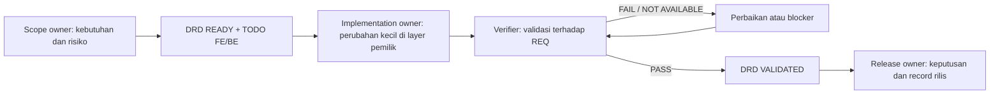

# Delivery Workflow and Roles — RME

**Status:** Active operational baseline under [ADR 0006](adr/0006-sdlc-operational-baseline.md)
**Scope:** Delivery responsibilities, review, QA traceability, handoff, and release record.
**Canonical lifecycle:** [Sistem Kerja Fitur](FEATURE_WORKFLOW.md)

Dokumen ini tidak membuat role aplikasi atau mengubah authorization. Ia menjelaskan siapa yang harus dicatat sebagai penanggung jawab delivery pada DRD dan bagaimana bukti berpindah dari scope ke keputusan rilis.

## 1. Alur delivery

Status, syarat masuk, dan syarat keluar hanya mengikuti `FEATURE_WORKFLOW.md`. Diagram ini bukan state machine tambahan.

## 2. Matriks tanggung jawab

| Tanggung jawab | Memastikan | Tidak boleh disimpulkan |
| --- | --- | --- |
| Scope owner | Scope, sumber, acceptance outcome, priority, dan keputusan bisnis yang belum pasti dicatat di DRD | Bahwa implementasi, test, atau integrasi sudah lulus |
| Implementation owner (FE/BE) | Task menunjuk `REQ-###`/`EV-###`, perubahan di layer pemilik, dan bukti teknis tersedia | Bahwa UI memberi authorization atau mock membuktikan sistem eksternal |
| Verifier / QA reviewer | Test case atau metode uji, input ter-redaksi, expected/actual, failure, retest, dan limitation dicatat | Bahwa review independen terjadi bila orangnya belum dicatat |
| Release owner | Candidate, environment, evidence snapshot, known risks, recovery/rollback reference, dan keputusan release dicatat | Bahwa platform deployment, approval eksternal, atau rollback berhasil tanpa evidence environment |
| Incident coordinator | Triage, containment, keputusan eskalasi, timeline, dan follow-up tercatat saat insiden | Bahwa control teknis atau kontak eskalasi tersedia bila belum dikonfigurasi |

Satu orang dapat menjalankan lebih dari satu tanggung jawab pada tim kecil. Bila verifier dan implementation owner sama untuk perubahan berisiko tinggi, DRD harus mencatat keterbatasan ini; tidak boleh disebut independent verification.

## 3. Minimum artefak per fitur

| Tahap | Artefak wajib | Artefak bila relevan |
| --- | --- | --- |
| Discover / Ready | DRD, TODO FE/BE, requirement, sumber, decision/assumption/blocker | ADR, contract update, risk assessment |
| Build | Task FE/BE dan perubahan layer pemilik | Migration/recovery plan, UI state checklist |
| Validate | Evidence ledger per requirement | `TC-###`, `BUG-###`, retest entry, integration correlation |
| Release decision | Release checklist DRD dan handoff | Candidate/environment record, rollback/recovery, incident note |

Gunakan template DRD untuk format optional QA dan release record. Jangan membuat second source of truth: test dan defect entry harus menunjuk requirement dan Evidence ID yang sama.

## 4. Review, defect, dan retest

1. Verifier memilih metode yang sesuai validation matrix di `FEATURE_WORKFLOW.md`.
2. Bila ada banyak scenario, buat `TC-###` yang menunjuk `REQ-###` atau `AC-###` pada DRD.
3. Hasil gagal dicatat sebagai `BUG-###` dengan severity, dampak, evidence, dan status. Bila external tracker dipilih di masa depan, simpan ID/link tracker tanpa menggandakan histori sensitif.
4. Implementation owner memperbaiki defect dan menunjuk bukti perbaikan baru.
5. Verifier menjalankan retest baru; result lama tidak ditulis ulang. Status defect hanya berubah berdasarkan hasil retest yang dicatat.
6. Test yang tidak dapat dijalankan diberi `NOT AVAILABLE` atau `BLOCKED`, dampak, dan pihak/lingkungan yang diperlukan. Ia tidak dihitung sebagai pass.

Detail tabel ada di [QA Traceability](QA_TRACEABILITY.md).

## 5. Handoff dan keputusan rilis

Handoff wajib memakai [template delivery handoff](templates/DELIVERY_HANDOFF_TEMPLATE.md) atau struktur yang ekivalen di DRD. Release owner hanya dapat mengubah status sesuai Governance setelah memeriksa:

- requirement dan TODO telah direkonsiliasi;
- evidence yang sesuai risiko tercatat, termasuk failure/skip;
- environment dan candidate teridentifikasi, atau limitation menyatakan keduanya belum tersedia;
- perubahan data memiliki recovery/rollback plan;
- risiko klinis, privacy/security, dan bridging ditangani sesuai sumber kanonik;
- open defect, blocker, dan keputusan override ditulis, bukan disembunyikan.

Dokumen proses deployment berada di [Deployment and Environments](DEPLOYMENT_AND_ENVIRONMENTS.md). Jika release owner atau environment belum bernama, pekerjaan tetap dapat `VALIDATED` bila requirementnya terpenuhi, tetapi tidak boleh diklaim `RELEASE_READY` atau deployed.
