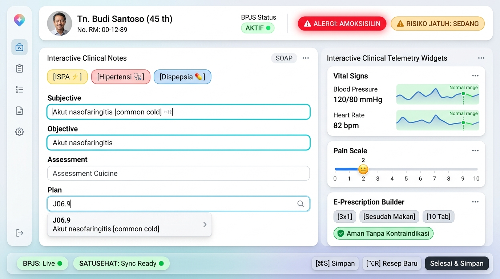

# 🎨 Modern Next-Gen Clinical Design System (Interactive & Ergonomic)

Dokumen ini mendefinisikan sistem desain antarmuka generasi baru untuk RME. Mengadopsi estetika modern kelas dunia (terinspirasi dari *Apple Health* dan *Linear*) dengan sentuhan interaktivitas tinggi, kartu *soft-elevation*, visualisasi telemetri klinis *real-time*, dan komponen cerdas berkecepatan tinggi.

---

## 📸 Preview Desain Generasi Baru



---

## 🌟 Pilar Interaktivitas & Daya Tarik Visual

| Komponen Interaktif | Tampilan Visual | Manfaat Klinis & UX |
| :--- | :--- | :--- |
| **Micro Sparkline Telemetry** | Grafik mini tren Tensi Darah & Nadi 3 kunjungan terakhir dengan zona hijau (*normal band*). | Dokter langsung mengetahui tren penurunan/kenaikan tensi tanpa harus membaca tabel riwayat satu per satu. |
| **Interactive Pain Scale Slider** | Slider visual gradasi warna (0–10) dilengkapi ikon emotikon ekspresi wajah dinamis (Wong-Baker/NRS). | Perawat/dokter cukup menggeser slider dengan mouse atau keyboard arrow (`←` / `→`). |
| **Smart Dosage Builder Chips** | Pill badge interaktif: `[3x1]` `[Sesudah Makan]` `[10 Tab]` `[Racikan]`. | Dokter cukup klik chip dosis yang paling sering digunakan; aturan pakai terisi otomatis dalam 1 klik. |
| **Dynamic Diagnostic Macro Pills** | Badge warna-warni dengan ikon: `[ISPA ⚡]` `[Hipertensi 🩺]` `[Dispepsia 💊]`. | 1-klik mengisi template SOAP, memfilter ICD-10 terkait, dan menyarankan resep standar. |
| **Glowing Patient Safety Pills** | Badge merah menyala lembut (*subtle pulse glow*) untuk alergi dan amber untuk risiko jatuh. | Memastikan dokter tidak melewatkan riwayat alergi fatal bahkan di saat kelelahan pada akhir shift. |
| **Glassmorphism Floating Action Dock** | Bar melayang di bawah layar dengan *backdrop blur*, live status dots, dan shortcut badge (`⌘S`, `⌥R`). | Bersih, elegan, dan menjaga fokus pandangan dokter pada formulir klinis utama. |

---

## 🎨 Palet Warna & Token Visual (Modern Health-Tech)

| Token | Warna / Hex | Tailwind CSS Class | Penggunaan & Efek Visual |
| :--- | :--- | :--- | :--- |
| **App Canvas** | `#F8FAFC` | `bg-slate-50/50` | Latar belakang bersih dengan gradien halus ke `#EFF6FF` (soft sky tint). |
| **Card Surface** | `#FFFFFF` | `bg-white/90 backdrop-blur-sm shadow-sm rounded-2xl border border-slate-200/80` | Kartu putih bersih dengan sudut lengkung modern (`rounded-2xl`). |
| **Active Glow Focus** | `#06B6D4` / `#0EA5E9` | `ring-2 ring-cyan-500/50 border-cyan-500 shadow-[0_0_12px_rgba(6,182,212,0.25)]` | Cincin fokus menyala lembut saat dokter mengetik atau mengklik field. |
| **Allergy Critical** | `#EF4444` | `bg-red-500 text-white shadow-[0_0_16px_rgba(239,68,68,0.4)] animate-pulse` | Badge merah dengan *subtle glowing pulse* untuk alergi obat berat. |
| **Fall Risk Warning** | `#F59E0B` | `bg-amber-100 text-amber-900 border border-amber-300 font-medium` | Badge peringatan risiko jatuh kuning/amber. |
| **Vitals Normal Zone** | `#10B981` | `bg-emerald-50 text-emerald-700 border-emerald-200` | Indikator rentang normal tanda vital & status BPJS aktif. |

---

## 🧩 Anatomi Komponen Spesifik

### 1. Kartu Telemetri Tanda Vital (dengan Sparkline Trend)
```tsx
// Cuplikan Konsep Komponen React + Recharts / SVG Sparkline
export function VitalSignsWidget({ bpHistory, heartRateHistory }) {
  return (
    <div className="bg-white rounded-2xl p-4 border border-slate-200/80 shadow-sm">
      <div className="flex justify-between items-center mb-3">
        <h4 className="font-semibold text-slate-800 text-sm">Vital Signs</h4>
        <span className="text-xs text-emerald-600 bg-emerald-50 px-2 py-0.5 rounded-full font-medium">
          Normal range
        </span>
      </div>

      {/* Blood Pressure Card with Mini Sparkline */}
      <div className="flex items-center justify-between p-3 bg-slate-50/70 rounded-xl mb-2">
        <div>
          <p className="text-xs text-slate-500">Blood Pressure</p>
          <p className="text-lg font-bold font-mono text-slate-900">120/80 <span className="text-xs font-normal text-slate-500">mmHg</span></p>
        </div>
        <MiniSparkline data={[125, 122, 118, 120]} normalRange={[110, 130]} color="#0ea5e9" />
      </div>

      {/* Heart Rate Card with Mini Sparkline */}
      <div className="flex items-center justify-between p-3 bg-slate-50/70 rounded-xl">
        <div>
          <p className="text-xs text-slate-500">Heart Rate</p>
          <p className="text-lg font-bold font-mono text-slate-900">82 <span className="text-xs font-normal text-slate-500">bpm</span></p>
        </div>
        <MiniSparkline data={[78, 85, 80, 82]} normalRange={[60, 100]} color="#10b981" />
      </div>
    </div>
  );
}
```

---

### 2. Slider Skala Nyeri Interaktif (Visual Pain Scale)
```tsx
export function InteractivePainSlider({ value, onChange }: { value: number; onChange: (v: number) => void }) {
  const getFaceEmoji = (val: number) => {
    if (val === 0) return '😊';
    if (val <= 3) return '🙂';
    if (val <= 6) return '😐';
    if (val <= 8) return '😣';
    return '😭';
  };

  return (
    <div className="bg-white rounded-2xl p-4 border border-slate-200/80 shadow-sm">
      <div className="flex justify-between items-center mb-2">
        <span className="text-sm font-semibold text-slate-800">Pain Scale</span>
        <div className="flex items-center gap-1.5 bg-sky-50 text-sky-700 px-2.5 py-0.5 rounded-full font-bold text-sm">
          <span>{getFaceEmoji(value)}</span>
          <span>{value} / 10</span>
        </div>
      </div>
      
      <input
        type="range"
        min="0"
        max="10"
        value={value}
        onChange={(e) => onChange(Number(e.target.value))}
        className="w-full accent-sky-500 h-2 bg-gradient-to-r from-emerald-400 via-amber-400 to-rose-500 rounded-lg cursor-pointer"
      />
      <div className="flex justify-between text-[11px] font-mono text-slate-400 mt-1">
        <span>0 (Bebas)</span>
        <span>5 (Sedang)</span>
        <span>10 (Tak Tertahankan)</span>
      </div>
    </div>
  );
}
```

---

### 3. Smart Dosage Builder Chips (Peresepan Cepat)
Dokter memilih obat, lalu klik chip dosis tanpa mengetik teks manual:
```tsx
export function DosageChips({ onSelect }: { onSelect: (rule: string) => void }) {
  const commonDosages = [
    { label: '3x1', text: '3 x 1 tablet sehari' },
    { label: '2x1', text: '2 x 1 tablet sehari' },
    { label: '1x1 malam', text: '1 x 1 tablet malam hari' },
    { label: 'Sesudah Makan', text: 'sesudah makan (p.c.)' },
    { label: 'Sebelum Makan', text: 'sebelum makan (a.c.)' },
    { label: '10 Tab', qty: 10 },
  ];

  return (
    <div className="flex flex-wrap gap-1.5 mt-2">
      {commonDosages.map((item, idx) => (
        <button
          key={idx}
          onClick={() => onSelect(item.text || `${item.qty}`)}
          className="px-2.5 py-1 text-xs font-medium rounded-lg bg-slate-100 text-slate-700 hover:bg-sky-50 hover:text-sky-700 hover:border-sky-200 border border-slate-200 transition-all active:scale-95"
        >
          {item.label}
        </button>
      ))}
    </div>
  );
}
```

---

## ⌨️ Floating Action Bar & Keyboard Shortcuts

Dock aksi di bagian bawah dibuat dengan gaya *modern glassmorphism*:
* `backdrop-blur-md bg-white/80 border border-slate-200/60 shadow-lg rounded-2xl`
* Memuat status live dot:
  * 🟢 **BPJS: Live ●** (terkoneksi WebSocket antrean)
  * 🟢 **SATUSEHAT: Sync Ready ●** (token valid & payload ter-bundle)
* Tombol aksi utama:
  * `[ Selesai & Simpan ]` dengan animasi hover dan shortcut `Ctrl + Enter`.
